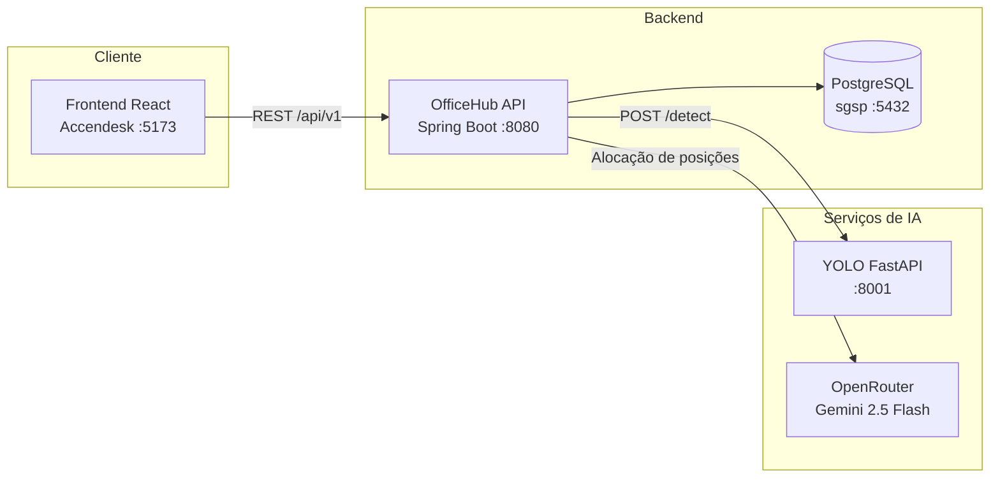

# Accendesk (OfficeHub)

Plataforma web para **gestão de salas corporativas**, **reservas de posições de trabalho** e **alocação inteligente de equipes**. O frontend **Accendesk** consome a API **OfficeHub** (Spring Boot) e integra um serviço de visão computacional (YOLO) para gerar layouts a partir de plantas baixas.

## Funcionalidades

- **Salas e layouts** — cadastro de salas, dimensões físicas, layouts, posições e equipamentos
- **Reservas** — solicitação, aprovação e gestão de reservas por horário
- **Equipes** — criação de equipes, gestores e membros com preferências de posição
- **Disponibilidade** — consulta de vagas e regras de disponibilidade por sala
- **Alocação por IA** — sugestão automática de quem senta onde (OpenRouter/Gemini ou algoritmo espacial de fallback)
- **Geração de layout por IA** — upload de planta baixa com detecção YOLO de mobiliário e equipamentos
- **Controle de acesso (RBAC)** — perfis com permissões distintas
- **Dashboard e relatórios** — estatísticas para administradores e gestores

## Arquitetura



## Estrutura do repositório

```
software-accenture/
├── frontend/              # Interface web (React + TypeScript + Vite)
├── backend/
│   └── officehub-v1/      # API REST (Spring Boot 4, Java 21)
├── PythonAPI_yolo/        # Detecção de objetos em plantas baixas (FastAPI + YOLO)
└── docs/
    └── FLUXO-IA.md        # Documentação detalhada do agente de alocação
```

## Pré-requisitos

| Componente | Requisito |
|------------|-----------|
| Frontend | Node.js 18+ e npm |
| Backend | Java 21 e Maven (ou `./mvnw`) |
| Banco de dados | PostgreSQL com database `sgsp` |
| YOLO API | Python 3.11 |
| IA de alocação | Chave da API [OpenRouter](https://openrouter.ai/) (opcional; há fallback espacial) |

## Configuração rápida

### 1. Banco de dados

Crie o banco PostgreSQL e aplique as migrações incrementais em `backend/officehub-v1/src/main/resources/db/migration/` (V002–V006). Ajuste credenciais em `application.properties` se necessário:

```properties
spring.datasource.url=jdbc:postgresql://localhost:5432/sgsp
spring.datasource.username=postgres
spring.datasource.password=123
```

### 2. Backend (OfficeHub)

```bash
cd backend/officehub-v1
./mvnw spring-boot:run
```

**Windows:**

```bat
cd backend\officehub-v1
mvnw.cmd spring-boot:run
```

A API sobe em `http://localhost:8080`. Documentação Swagger: `http://localhost:8080/swagger-ui/index.html`.

Variáveis de ambiente úteis:

| Variável | Descrição | Padrão |
|----------|-----------|--------|
| `OPENROUTER_API_KEY` | Chave para alocação via LLM | — |
| `IA_MOTOR` | `OPENROUTER` ou `ESPACIAL` | `OPENROUTER` |
| `YOLO_BASE_URL` | URL do serviço YOLO | `http://127.0.0.1:8001` |

### 3. YOLO API (detecção em plantas baixas)

Necessário para a funcionalidade **Gerar Sala por IA**. O modelo treinado detecta: cadeira, impressora, mesa-digitalizadora, monitor, notebook e projetor.

```bash
cd PythonAPI_yolo
pip install -r requirements.txt
python -m uvicorn app.main:app --reload --host 127.0.0.1 --port 8001
```

**Windows:** execute `run.bat` (cria venv, instala dependências e inicia na porta 8001).

Opcionalmente, copie `.env.example` para `.env`:

```env
MODEL_PATH=models/best.pt
CONFIDENCE_THRESHOLD=0.25
```

Swagger: `http://127.0.0.1:8001/docs`

### 4. Frontend (Accendesk)

```bash
cd frontend
npm install
cp .env.example .env   # ou crie manualmente no Windows
npm run dev
```

Arquivo `.env`:

```env
VITE_API_BASE_URL=http://localhost:8080/api/v1
```

A interface fica disponível em `http://localhost:5173`.

## Perfis de acesso

| Perfil | Descrição |
|--------|-----------|
| `ADMIN_SALA` | Administra salas, layouts, posições, equipamentos, usuários e execuções de IA |
| `GESTOR_RESERVAS` | Gerencia reservas, equipes e relatórios |
| `USUARIO_FINAL` | Solicita e cancela reservas; visualiza suas equipes |
| `INTEGRADOR` | Integração via API de disponibilidade e reservas |

Os perfis padrão são criados automaticamente na inicialização do backend (`PerfilDataInitializer`).

## Principais endpoints

| Módulo | Base path |
|--------|-----------|
| Autenticação | `/api/v1/auth` |
| Salas | `/api/v1/salas` |
| Reservas (incl. sugestão IA) | `/api/v1/reservas` |
| Equipes | `/api/v1/equipes` |
| Layouts e posições | `/api/v1/layouts`, `/api/v1/posicoes` |
| Geração de layout por IA | `/api/v1/ia/layout` |
| Execuções de IA | `/api/v1/ia/execucoes` |
| Relatórios | `/api/v1/relatorios` |

## Fluxo de alocação inteligente

1. O usuário solicita uma sugestão via `POST /api/v1/reservas/sugerir`.
2. O backend monta o contexto (pessoas, preferências, posições livres) e executa o agente de alocação.
3. O motor principal (OpenRouter/Gemini) sugere a distribuição; em caso de falha, o algoritmo espacial assume como fallback.
4. A execução é registrada para auditoria; o frontend confirma a reserva usando o `execucaoId`.

Detalhes completos em [`docs/FLUXO-IA.md`](docs/FLUXO-IA.md).

## Scripts úteis

**Frontend**

```bash
npm run dev       # desenvolvimento
npm run build     # build de produção
npm run lint      # ESLint
npm run preview   # preview do build
```

**Backend**

```bash
./mvnw test                  # testes
./mvnw spring-boot:run       # executar aplicação
```

## Stack tecnológica

| Camada | Tecnologias |
|--------|-------------|
| Frontend | React 19, TypeScript, Vite, React Router |
| Backend | Spring Boot 4, Spring Security, JPA, JWT, PostgreSQL |
| Visão computacional | FastAPI, Ultralytics YOLO, Pillow |
| IA de alocação | OpenRouter (Gemini 2.5 Flash) + motor espacial |

## Licença

Projeto desenvolvido no contexto Accenture. Consulte os mantenedores do repositório para informações de licenciamento e uso.
