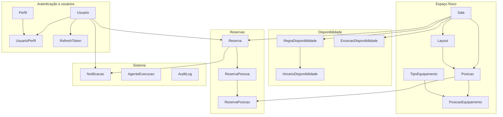

# Repositories — OfficeHub v1

Este documento descreve a camada de **Repositories** do backend `officehub-v1`: interfaces Spring Data JPA que abstraem o acesso ao banco de dados PostgreSQL.

**Pacote:** `com.accenture.officehub_v1.repository`

---

## O que é um Repository?

No Spring Boot, um **Repository** é uma interface que o framework implementa automaticamente em tempo de execução. Cada repository estende `JpaRepository<Entity, ID>` e fica vinculado a uma entidade JPA (`@Entity`) e à tabela correspondente.

Benefícios principais:

- **CRUD pronto** — criar, ler, atualizar e excluir sem SQL manual.
- **Injeção por construtor** — services e controllers recebem o repository via `@RequiredArgsConstructor` ou construtor explícito.
- **Transações** — operações de escrita participam do contexto transacional do Spring quando chamadas a partir de um `@Service` anotado com `@Transactional`.
- **Extensível** — métodos derivados do nome (`findByEmail`), `@Query` JPQL/SQL nativo ou `Specification` podem ser adicionados quando necessário.

### Métodos herdados de `JpaRepository`

Todos os repositories deste projeto expõem, entre outros, os métodos abaixo (sem declaração extra no código):

| Método | Descrição |
|--------|-----------|
| `save(entity)` | Insere ou atualiza o registro |
| `findById(id)` | Retorna `Optional<Entity>` |
| `findAll()` | Lista todos os registros |
| `findAll(Pageable)` | Lista paginada |
| `deleteById(id)` / `delete(entity)` | Remove registro |
| `existsById(id)` | Verifica existência |
| `count()` | Conta registros |

> **Estado atual:** nenhum repository define consultas customizadas. Toda a lógica de busca específica (por e-mail, por sala, por data, etc.) ainda precisará ser adicionada como métodos na interface ou feita em memória via `findAll()` — o que não é recomendado em produção.

---

## Visão geral por domínio



---

## Repositories por categoria

### 1. Usuários, perfis e autenticação

#### `UsuarioRepository`

| Campo | Valor |
|-------|-------|
| **Entidade** | `Usuario` |
| **Tabela** | `usuarios` |
| **Tipo de ID** | `UUID` |

Persiste usuários do sistema (nome, e-mail, hash de senha, flag `ativo`, soft delete via `deleted_at`).

```java
public interface UsuarioRepository extends JpaRepository<Usuario, UUID> {
}
```

---

#### `PerfilRepository`

| Campo | Valor |
|-------|-------|
| **Entidade** | `Perfil` |
| **Tabela** | `perfis` |
| **Tipo de ID** | `UUID` |

Catálogo de perfis de acesso (ex.: administrador, solicitante).

---

#### `UsuarioPerfilRepository`

| Campo | Valor |
|-------|-------|
| **Entidade** | `UsuarioPerfil` |
| **Tabela** | `usuario_perfis` |
| **Tipo de ID** | `UsuarioPerfilId` (chave composta) |

Tabela de associação **N:N** entre `Usuario` e `Perfil`. Usa `@EmbeddedId` com `usuarioId` + `perfilId`. É o único repository cujo ID **não** é `UUID`.

```java
public interface UsuarioPerfilRepository extends JpaRepository<UsuarioPerfil, UsuarioPerfilId> {
}
```

---

#### `RefreshTokenRepository`

| Campo | Valor |
|-------|-------|
| **Entidade** | `RefreshToken` |
| **Tabela** | `refresh_tokens` |
| **Tipo de ID** | `UUID` |

Tokens de atualização de sessão vinculados a `usuario_id`, com hash, expiração e revogação.

---

### 2. Salas, layouts e posições

#### `SalaRepository`

| Campo | Valor |
|-------|-------|
| **Entidade** | `Sala` |
| **Tabela** | `salas` |
| **Tipo de ID** | `UUID` |

Salas de reunião/trabalho: capacidade, andar, bloco, status (`StatusSala`), imagem e referência a quem criou (`created_by`).

---

#### `LayoutRepository`

| Campo | Valor |
|-------|-------|
| **Entidade** | `Layout` |
| **Tabela** | `layouts` |
| **Tipo de ID** | `UUID` |

Versões do mapa/planta de uma sala (`sala_id`), com flag `ativo` e aprovação (`aprovado_por`, `aprovado_em`).

---

#### `PosicaoRepository`

| Campo | Valor |
|-------|-------|
| **Entidade** | `Posicao` |
| **Tabela** | `posicoes` |
| **Tipo de ID** | `UUID` |

Assentos ou lugares dentro de uma sala e layout: identificador único por sala, coordenadas (`coord_x`, `coord_y`), tipo de cadeira/mesa.

**Restrição:** `UNIQUE (sala_id, identificador)`.

---

#### `TipoEquipamentoRepository`

| Campo | Valor |
|-------|-------|
| **Entidade** | `TipoEquipamento` |
| **Tabela** | `tipos_equipamento` |
| **Tipo de ID** | `UUID` |

Cadastro de tipos de equipamento (monitor, headset, etc.).

---

#### `PosicaoEquipamentoRepository`

| Campo | Valor |
|-------|-------|
| **Entidade** | `PosicaoEquipamento` |
| **Tabela** | `posicao_equipamentos` |
| **Tipo de ID** | `UUID` |

Quantidade de cada tipo de equipamento em uma posição.

**Restrição:** `UNIQUE (posicao_id, tipo_equipamento_id)`.

---

### 3. Disponibilidade de salas

#### `RegraDisponibilidadeRepository`

| Campo | Valor |
|-------|-------|
| **Entidade** | `RegraDisponibilidade` |
| **Tabela** | `regras_disponibilidade` |
| **Tipo de ID** | `UUID` |

Regra principal por sala (relação 1:1 com `Sala`): antecedência mínima em dias para reservar.

---

#### `HorarioDisponibilidadeRepository`

| Campo | Valor |
|-------|-------|
| **Entidade** | `HorarioDisponibilidade` |
| **Tabela** | `horarios_disponibilidade` |
| **Tipo de ID** | `UUID` |

Faixas de horário por dia da semana (0–6) ligadas a uma `RegraDisponibilidade`.

---

#### `ExcecaoDisponibilidadeRepository`

| Campo | Valor |
|-------|-------|
| **Entidade** | `ExcecaoDisponibilidade` |
| **Tabela** | `excecoes_disponibilidade` |
| **Tipo de ID** | `UUID` |

Datas em que a sala **não** está disponível (feriados, manutenção), com motivo opcional.

**Restrição:** `UNIQUE (sala_id, data)`.

---

### 4. Reservas

#### `ReservaRepository`

| Campo | Valor |
|-------|-------|
| **Entidade** | `Reserva` |
| **Tabela** | `reservas` |
| **Tipo de ID** | `UUID` |

Pedido de reserva: sala, solicitante, data, quantidade de pessoas, status (`StatusReserva`), cancelamento.

---

#### `ReservaPessoaRepository`

| Campo | Valor |
|-------|-------|
| **Entidade** | `ReservaPessoa` |
| **Tabela** | `reserva_pessoas` |
| **Tipo de ID** | `UUID` |

Participantes da reserva: usuário interno **ou** `nome_externo`, com até três preferências de tipo de assento.

---

#### `ReservaPosicaoRepository`

| Campo | Valor |
|-------|-------|
| **Entidade** | `ReservaPosicao` |
| **Tabela** | `reserva_posicoes` |
| **Tipo de ID** | `UUID` |

Alocação efetiva: liga uma `ReservaPessoa` a uma `Posicao` dentro da reserva.

**Restrição:** cada `reserva_pessoa_id` aparece no máximo uma vez (`UNIQUE`).

---

### 5. Notificações, agentes e auditoria

#### `NotificacaoRepository`

| Campo | Valor |
|-------|-------|
| **Entidade** | `Notificacao` |
| **Tabela** | `notificacoes` |
| **Tipo de ID** | `UUID` |

Fila de notificações por usuário (e opcionalmente por reserva): assunto, mensagem, status (`StatusNotificacao`), tentativas de envio.

---

#### `AgenteExecucaoRepository`

| Campo | Valor |
|-------|-------|
| **Entidade** | `AgenteExecucao` |
| **Tabela** | `agente_execucoes` |
| **Tipo de ID** | `UUID` |

Registro de execuções de agentes/automação (ex.: IA para alocação de assentos): payloads JSON, status, tempo de processamento, erros.

---

#### `AuditLogRepository`

| Campo | Valor |
|-------|-------|
| **Entidade** | `AuditLog` |
| **Tabela** | `audit_log` |
| **Tipo de ID** | `UUID` |

Trilha de auditoria: ação, entidade afetada, snapshots JSON antes/depois, IP e user-agent.

---

## Tabela resumo

| Repository | Entidade | Tabela | ID |
|------------|----------|--------|-----|
| `UsuarioRepository` | `Usuario` | `usuarios` | `UUID` |
| `PerfilRepository` | `Perfil` | `perfis` | `UUID` |
| `UsuarioPerfilRepository` | `UsuarioPerfil` | `usuario_perfis` | `UsuarioPerfilId` |
| `RefreshTokenRepository` | `RefreshToken` | `refresh_tokens` | `UUID` |
| `SalaRepository` | `Sala` | `salas` | `UUID` |
| `LayoutRepository` | `Layout` | `layouts` | `UUID` |
| `PosicaoRepository` | `Posicao` | `posicoes` | `UUID` |
| `TipoEquipamentoRepository` | `TipoEquipamento` | `tipos_equipamento` | `UUID` |
| `PosicaoEquipamentoRepository` | `PosicaoEquipamento` | `posicao_equipamentos` | `UUID` |
| `RegraDisponibilidadeRepository` | `RegraDisponibilidade` | `regras_disponibilidade` | `UUID` |
| `HorarioDisponibilidadeRepository` | `HorarioDisponibilidade` | `horarios_disponibilidade` | `UUID` |
| `ExcecaoDisponibilidadeRepository` | `ExcecaoDisponibilidade` | `excecoes_disponibilidade` | `UUID` |
| `ReservaRepository` | `Reserva` | `reservas` | `UUID` |
| `ReservaPessoaRepository` | `ReservaPessoa` | `reserva_pessoas` | `UUID` |
| `ReservaPosicaoRepository` | `ReservaPosicao` | `reserva_posicoes` | `UUID` |
| `NotificacaoRepository` | `Notificacao` | `notificacoes` | `UUID` |
| `AgenteExecucaoRepository` | `AgenteExecucao` | `agente_execucoes` | `UUID` |
| `AuditLogRepository` | `AuditLog` | `audit_log` | `UUID` |

**Total:** 18 repositories.

---

## Como usar em um Service

Exemplo de injeção e uso básico:

```java
@Service
@RequiredArgsConstructor
public class SalaService {

    private final SalaRepository salaRepository;

    public Sala buscarPorId(UUID id) {
        return salaRepository.findById(id)
                .orElseThrow(() -> new EntityNotFoundException("Sala não encontrada: " + id));
    }

    public Sala criar(Sala sala) {
        return salaRepository.save(sala);
    }
}
```

O Spring detecta interfaces que estendem `JpaRepository` no pacote da aplicação (ou subpacotes configurados em `@EnableJpaRepositories`) e registra beans prontos para injeção.

---

## Como adicionar consultas customizadas

Quando `findAll()` não for suficiente, declare métodos na interface do repository. O Spring Data gera a implementação a partir do nome ou da anotação.

**Query method (derivado do nome):**

```java
public interface UsuarioRepository extends JpaRepository<Usuario, UUID> {
    Optional<Usuario> findByEmailAndDeletedAtIsNull(String email);
}
```

**JPQL explícito:**

```java
@Query("SELECT r FROM Reserva r WHERE r.sala.id = :salaId AND r.dataReserva = :data")
List<Reserva> findBySalaAndData(@Param("salaId") UUID salaId, @Param("data") LocalDate data);
```

**SQL nativo** (quando necessário performance ou funções do PostgreSQL):

```java
@Query(value = "SELECT * FROM reservas WHERE sala_id = :salaId", nativeQuery = true)
List<Reserva> findNativeBySala(@Param("salaId") UUID salaId);
```

---

## Boas práticas neste projeto

1. **Manter repositories finos** — regras de negócio ficam em `@Service`; o repository só acessa dados.
2. **Respeitar soft delete** — entidades como `Usuario`, `Sala` e `Reserva` possuem `deleted_at`; consultas devem filtrar registros ativos quando aplicável.
3. **Lazy loading** — relacionamentos `@ManyToOne(fetch = LAZY)` exigem transação aberta ou `JOIN FETCH` em queries que retornem grafos completos.
4. **Chave composta** — em `UsuarioPerfil`, use `UsuarioPerfilId` ao chamar `findById`, `deleteById` ou `existsById`.
5. **Evitar N+1** — para listagens com relacionamentos, prefira `@EntityGraph` ou `@Query` com `join fetch`.

---

## Estrutura de arquivos

```
src/main/java/com/accenture/officehub_v1/
├── entity/          # Entidades JPA (@Entity)
└── repository/      # Interfaces Repository (este documento)
    ├── UsuarioRepository.java
    ├── PerfilRepository.java
    ├── UsuarioPerfilRepository.java
    ├── RefreshTokenRepository.java
    ├── SalaRepository.java
    ├── LayoutRepository.java
    ├── PosicaoRepository.java
    ├── TipoEquipamentoRepository.java
    ├── PosicaoEquipamentoRepository.java
    ├── RegraDisponibilidadeRepository.java
    ├── HorarioDisponibilidadeRepository.java
    ├── ExcecaoDisponibilidadeRepository.java
    ├── ReservaRepository.java
    ├── ReservaPessoaRepository.java
    ├── ReservaPosicaoRepository.java
    ├── NotificacaoRepository.java
    ├── AgenteExecucaoRepository.java
    └── AuditLogRepository.java
```
