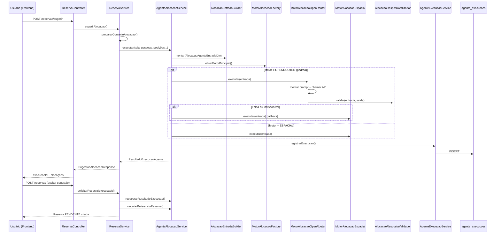

# Fluxo de Funcionamento da IA — OfficeHub

Este documento descreve como o agente de **alocação inteligente de posições** funciona no OfficeHub: fluxo ponta a ponta, classes envolvidas, motores de decisão e integração com frontend e banco de dados.

---

## Visão geral

A IA do OfficeHub resolve um problema de **otimização combinatória**: dado um conjunto de pessoas (com preferências de equipamento/tipo de posição, papel na equipe e critérios de proximidade) e um conjunto de posições livres em uma sala, sugere **quem senta onde**.

O sistema possui **dois motores** de alocação:

| Motor | Classe | Quando é usado |
|-------|--------|----------------|
| **OpenRouter (LLM)** | `MotorAlocacaoOpenRouter` | Motor principal (padrão). Usa Gemini 2.5 Flash via API OpenRouter. |
| **Algoritmo espacial** | `MotorAlocacaoEspacial` | Fallback automático se o OpenRouter falhar, ou motor principal se `ia.motor=ESPACIAL`. |

Toda execução é **auditada** na tabela `agente_execucoes`, permitindo rastreio administrativo de entradas, saídas, tempo e tokens consumidos.

---

## Diagrama de fluxo



---

## Fluxos principais

### 1. Primeira sugestão de alocação

**Endpoint:** `POST /api/v1/reservas/sugerir`

1. O frontend envia `SolicitarReservaRequest` (sala, data, horário, equipe, pessoas e preferências).
2. `ReservaService.prepararContextoAlocacao()` valida regras de negócio e busca posições livres no horário.
3. `AgenteAlocacaoService.executar()` monta o payload via `AlocacaoEntradaBuilder`.
4. Se `ia.motor=OPENROUTER` (padrão):
   - Tenta `MotorAlocacaoOpenRouter`.
   - Em caso de falha lógica (`sucesso=false`) ou indisponibilidade da API → aciona `MotorAlocacaoEspacial` como fallback.
5. A resposta é convertida para `ResultadoAlocacao` e registrada em `agente_execucoes`.
6. Retorna `SugestaoAlocacaoResponse` com `execucaoId`, lista de alocações e avisos.

### 2. Nova sugestão (alternativa)

**Endpoint:** `POST /api/v1/reservas/sugerir/outra`

Semelhante ao fluxo anterior, porém:

- O frontend envia `combinacoesExcluidas`: lista de combinações de `posicaoId` já apresentadas.
- O agente **não usa fallback espacial** neste cenário — apenas re-chama o OpenRouter com temperatura crescente (até 5 tentativas).
- Se todas as alternativas foram esgotadas (caso típico: reserva individual), permite repetir combinação com `instrucaoRepeticaoPermitida=true`.

### 3. Aceitar sugestão e criar reserva

**Endpoint:** `POST /api/v1/reservas`

1. O frontend envia `AceitarSugestaoReservaRequest` com `execucaoId` da sugestão escolhida.
2. `AgenteAlocacaoService.recuperarResultadoExecucao()` revalida o payload salvo no banco (não reexecuta a IA).
3. Verifica se a execução ainda está disponível (`status=SUCESSO`, `referenciaId=null`).
4. Cria reserva com status `PENDENTE` e vincula `referenciaId` da execução à reserva.

### 4. Consulta administrativa

**Endpoint:** `GET /api/v1/ia/execucoes`

- Filtros: `tipoAgente`, `status`, `dataInicio`, `dataFim`.
- Consumido pela página `IaExecucoesPage` (admin).

---

## Camadas e classes

### Controllers (API REST)

| Classe | Responsabilidade |
|--------|------------------|
| `ReservaController` | Expõe `/sugerir`, `/sugerir/outra` e aceite da sugestão. |
| `IaExecucaoController` | Expõe histórico de execuções em `/ia/execucoes`. |

### Serviços de orquestração

| Classe | Pacote | Responsabilidade |
|--------|--------|------------------|
| `ReservaService` | `service` | Valida contexto da reserva, delega à IA e monta resposta para o frontend. |
| `AgenteAlocacaoService` | `service.ia` | **Orquestrador central da IA.** Escolhe motor, gerencia fallback, nova sugestão, conversão de resultados e registro de execução. |
| `AgenteExecucaoService` | `service.ia` | Persiste e consulta logs de execução (`agente_execucoes`). |
| `AlocacaoEntradaBuilder` | `service.ia` | Monta `AlocacaoAgenteEntradaDto` a partir de entidades de domínio (sala, pessoas, posições, equipamentos, papéis na equipe). |

### Motores de alocação

| Classe | Interface | Responsabilidade |
|--------|-----------|------------------|
| `MotorAlocacao` | — | Contrato: `executar(AlocacaoAgenteEntradaDto) → AlocacaoAgenteSaidaDto`. |
| `MotorAlocacaoOpenRouter` | `MotorAlocacao` | Integração com OpenRouter: monta prompt, chama API REST, parseia JSON, valida resposta. |
| `MotorAlocacaoEspacial` | `MotorAlocacao` | Algoritmo local com busca combinatória e sistema de **score** (proximidade, tipo de pessoa, agrupamento de equipe). |
| `MotorAlocacaoFactory` | — | Seleciona motor principal/fallback conforme `IaProperties.motor`. |

### Validação e utilitários

| Classe | Responsabilidade |
|--------|------------------|
| `AlocacaoRespostaValidador` | Valida saída da IA: IDs válidos, sem duplicatas, compatibilidade de preferências, combinações excluídas. |
| `PosicaoCompatibilidade` | Regra OR: posição compatível se tipo **ou** equipamento coincide com preferências (case-insensitive). |
| `OpenRouterAlocacaoPrompt` | System prompt e mensagens de usuário (incluindo instruções para nova sugestão). |
| `OpenRouterRespostaParser` | Extrai JSON da resposta do LLM (remove markdown ```) e normaliza campos. |
| `ConstantesAgenteIa` | Constantes de tipo (`ALOCACAO`) e versões de modelo registradas. |

### Exceções específicas

| Classe | Quando ocorre |
|--------|---------------|
| `OpenRouterIndisponivelException` | API key ausente, erro HTTP ou JSON inválido → dispara fallback. |
| `OpenRouterRespostaInvalidaException` | Resposta vazia ou sem conteúdo utilizável. |

### DTOs de entrada (payload enviado ao motor)

| Record | Campos principais |
|--------|-------------------|
| `AlocacaoAgenteEntradaDto` | `salaId`, `data`, `criterioProximidade`, `raioProximidade`, `coordEntradaX/Y`, `pessoas`, `posicoesLivres`, `combinacoesExcluidas`. |
| `PessoaAlocacaoEntradaDto` | `id`, `nome`, `tipo` (GESTOR, LIDER_EQUIPE, FUNCIONARIO, VISITANTE), `equipeId`, preferências. |
| `PosicaoLivreEntradaDto` | `id`, coordenadas, `tipo`, `equipamentos`. |

### DTOs de saída (resposta do motor)

| Record | Campos principais |
|--------|-------------------|
| `AlocacaoAgenteSaidaDto` | `sucesso`, `scoreTotal`, `motivoFalha`, `avisoProximidade`, `alocacoes`, `tokensUtilizados`. |
| `PosicaoAlocadaSaidaDto` | Par `pessoaId` ↔ `posicaoId`. |

### DTOs OpenRouter (integração HTTP)

| Record | Uso |
|--------|-----|
| `OpenRouterRequestDto` | Corpo da requisição (model, messages, temperature, max_tokens, response_format). |
| `OpenRouterResponseDto` | Resposta da API (choices, usage). |
| `OpenRouterMessageDto` | Mensagens system/user. |
| `OpcoesChamadaOpenRouter` | Temperatura, tentativa, flags de nova sugestão. |
| `ResultadoChamadaOpenRouter` | Saída + erro de validação + tempo em ms. |

### Entidade e persistência

| Classe | Tabela | Campos relevantes |
|--------|--------|-------------------|
| `AgenteExecucao` | `agente_execucoes` | `tipoAgente`, `versaoModelo`, `status`, `payloadEntrada` (JSONB), `payloadSaida` (JSONB), `tempoProcessamentoMs`, `referenciaId`, `erroMensagem`. |
| `AgenteExecucaoRepository` | — | Queries por tipo, status e intervalo de datas. |
| `StatusAgente` (enum) | — | `SUCESSO`, `FALHA`, `PROCESSANDO`. |

### Configuração

| Classe / Arquivo | Responsabilidade |
|------------------|------------------|
| `IaProperties` | `@ConfigurationProperties(prefix = "ia")` — motor, API key, model, max tokens. |
| `application.properties` | `ia.motor`, `ia.openrouter.*` (variáveis de ambiente suportadas). |
| `TipoMotorAlocacao` (enum) | `OPENROUTER` (padrão) ou `ESPACIAL`. |

### Domínio de alocação (resultado interno)

| Classe | Responsabilidade |
|--------|------------------|
| `ResultadoAlocacao` | Resultado de negócio: sucesso/falha, lista de `ItemAlocacao`, aviso de proximidade. |
| `ItemAlocacao` | Par `PessoaReservaRequest` + `Posicao`. |
| `ResultadoExecucaoAgente` | Encapsula `ResultadoAlocacao` + `execucaoId` (UUID da execução persistida). |

---

## Motor OpenRouter (LLM)

### Configuração padrão

```properties
ia.motor=OPENROUTER
ia.openrouter.model=google/gemini-2.5-flash
ia.openrouter.max-tokens=2000
ia.openrouter.api-key=${OPENROUTER_API_KEY}
```

### Etapas internas (`MotorAlocacaoOpenRouter`)

1. **Validar configuração** — exige `OPENROUTER_API_KEY`.
2. **Serializar entrada** — `AlocacaoAgenteEntradaDto` → JSON.
3. **Montar request** — system prompt (`OpenRouterAlocacaoPrompt.SYSTEM_PROMPT`) + mensagem user com dados da reserva.
4. **Chamar API** — `POST https://openrouter.ai/api/v1/chat/completions` com `response_format: json_object`.
5. **Parsear resposta** — `OpenRouterRespostaParser` extrai JSON puro.
6. **Validar** — `AlocacaoRespostaValidador` garante integridade antes de aceitar.
7. **Enriquecer** — adiciona `tokensUtilizados` da resposta OpenRouter.

### Regras do prompt (resumo)

- Usar **somente UUIDs** presentes na entrada.
- Cada pessoa → exatamente uma posição; cada posição → no máximo uma pessoa.
- Preferências de equipamento/tipo são **OR** (qualquer match serve).
- `criterioProximidade`:
  - **OBRIGATORIA** — todos dentro do `raioProximidade`.
  - **PREFERENCIAL** — prioriza proximidade, mas aloca mesmo fora do raio (com aviso).
- **VISITANTE** → perto da entrada (`coordEntradaX/Y`).
- **GESTOR/LIDER** → perto dos funcionários da equipe.
- **Nova sugestão** → combinação diferente das excluídas.

---

## Motor espacial (fallback / alternativo)

`MotorAlocacaoEspacial` implementa busca combinatória com pontuação heurística:

| Fator | Score |
|-------|-------|
| Funcionário próximo da equipe (≤ raio) | +50 |
| Gestor/líder próximo da equipe | +30 |
| Visitante próximo da entrada | +20 |
| Funcionário distante da equipe | −40 |
| Quebra de preferência | −20 |
| Posição isolada | −10 |
| Bônus: equipe inteira agrupada no raio | +100 |

**Ordem de alocação:** LIDER_EQUIPE → GESTOR → FUNCIONARIO → VISITANTE.

Em modo **proximidade obrigatória**, descarta combinações onde qualquer par de posições excede o raio.

---

## Montagem da entrada (`AlocacaoEntradaBuilder`)

Responsabilidades:

1. Carregar equipamentos de cada posição via `PosicaoEquipamentoRepository`.
2. Calcular coordenadas de entrada como **menor X e menor Y** das posições (proxy de porta/entrada).
3. Resolver **tipo de pessoa**:
   - `LIDER_EQUIPE` — primeiro gestor da equipe.
   - `GESTOR` — membro em `equipe_gestores`.
   - `FUNCIONARIO` — membro em `equipe_membros`.
   - `VISITANTE` — demais participantes em reserva de equipe.
4. Mapear preferências (`tipoPreferido1/2/3`) para `tiposPosicaoCompativeis` e `equipamentosPreferidos`.

---

## Frontend

| Arquivo | Função |
|---------|--------|
| `frontend/src/api/reservas.ts` | `sugerir()`, `sugerirOutra()`, criar reserva com `execucaoId`. |
| `frontend/src/api/ia.ts` | `listarExecucoes()` para painel admin. |
| `frontend/src/pages/reservas/NovaReservaPage.tsx` | Fluxo UX: solicitar sugestão, cardápio de alternativas, aceitar e criar reserva. |
| `frontend/src/pages/admin/IaExecucoesPage.tsx` | Visualização de logs (motor, status, payloads resumidos). |

### Fluxo na tela de nova reserva

1. Usuário preenche dados e clica em **Sugerir alocação**.
2. Frontend chama `POST /reservas/sugerir` e guarda `execucaoId`.
3. Usuário pode clicar em **Sugerir outra** — envia `combinacoesExcluidas` com IDs das posições já sugeridas.
4. Ao confirmar, envia `POST /reservas` com `execucaoId` da sugestão selecionada.

---

## Registro e auditoria

Cada execução grava em `agente_execucoes`:

| Campo | Exemplo |
|-------|---------|
| `tipoAgente` | `ALOCACAO` |
| `versaoModelo` | `OPENROUTER_GEMINI_FLASH_V1` ou `ALGORITMO_ESPACIAL_V2` |
| `status` | `SUCESSO` / `FALHA` |
| `payloadEntrada` | JSON completo enviado ao motor |
| `payloadSaida` | JSON de resposta (+ `tokensUtilizados` quando OpenRouter) |
| `tempoProcessamentoMs` | Tempo da chamada |
| `referenciaId` | UUID da reserva (após aceite) |

Falhas do OpenRouter são registradas **antes** do fallback espacial, permitindo diagnóstico mesmo quando a alocação final é bem-sucedida pelo algoritmo local.

---

## Variáveis de ambiente

| Variável | Descrição | Padrão |
|----------|-----------|--------|
| `IA_MOTOR` | `OPENROUTER` ou `ESPACIAL` | `OPENROUTER` |
| `OPENROUTER_API_KEY` | Chave da API OpenRouter | — (obrigatória para LLM) |
| `OPENROUTER_BASE_URL` | URL da API | `https://openrouter.ai/api/v1/chat/completions` |
| `OPENROUTER_MAX_TOKENS` | Limite de tokens | `2000` |

---

## Estrutura de pacotes (backend)

```
com.accenture.officehub_v1
├── config/
│   └── IaProperties.java
├── controller/
│   ├── ReservaController.java
│   └── IaExecucaoController.java
├── dto/ia/
│   ├── AlocacaoAgenteEntradaDto.java
│   ├── AlocacaoAgenteSaidaDto.java
│   ├── PessoaAlocacaoEntradaDto.java
│   ├── PosicaoAlocadaSaidaDto.java
│   ├── PosicaoLivreEntradaDto.java
│   └── openrouter/          # DTOs da API OpenRouter
├── entity/
│   └── AgenteExecucao.java
└── service/ia/
    ├── AgenteAlocacaoService.java      ← orquestrador
    ├── AgenteExecucaoService.java      ← auditoria
    ├── AlocacaoEntradaBuilder.java     ← montagem do payload
    ├── ConstantesAgenteIa.java
    ├── PosicaoCompatibilidade.java
    ├── ResultadoExecucaoAgente.java
    └── motor/
        ├── MotorAlocacao.java          ← interface
        ├── MotorAlocacaoOpenRouter.java
        ├── MotorAlocacaoEspacial.java
        ├── MotorAlocacaoFactory.java
        ├── AlocacaoRespostaValidador.java
        ├── OpenRouterAlocacaoPrompt.java
        ├── OpenRouterRespostaParser.java
        └── ...
```

---

## Testes automatizados

| Arquivo de teste | Cobertura |
|------------------|-----------|
| `MotorAlocacaoOpenRouterTest` | Integração mockada com OpenRouter |
| `MotorAlocacaoEspacialTest` | Cenários do algoritmo espacial |
| `AlocacaoRespostaValidadorTest` | Validação de respostas da IA |
| `OpenRouterRespostaParserTest` | Parsing de JSON do LLM |
| `PosicaoCompatibilidadeTest` | Regras de compatibilidade |
| `ReservaAgenteAlocacaoIntegrationTest` | Fluxo completo de sugestão |
| `ReservaOpenRouterFallbackIntegrationTest` | Fallback quando OpenRouter falha |

---

## Resumo executivo

A IA do OfficeHub **não é um chatbot** — é um **agente de decisão estruturado** que recebe dados tipados, produz JSON validado e persiste cada execução. O OpenRouter (Gemini Flash) é o cérebro principal; o algoritmo espacial garante **resiliência** quando a API externa falha ou retorna alocação inválida. O frontend interage exclusivamente via `ReservaController`, usando `execucaoId` como token de confiança entre sugestão e confirmação da reserva.
